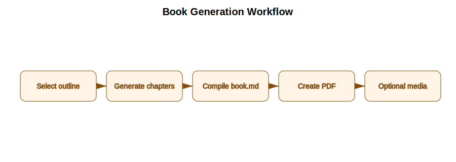
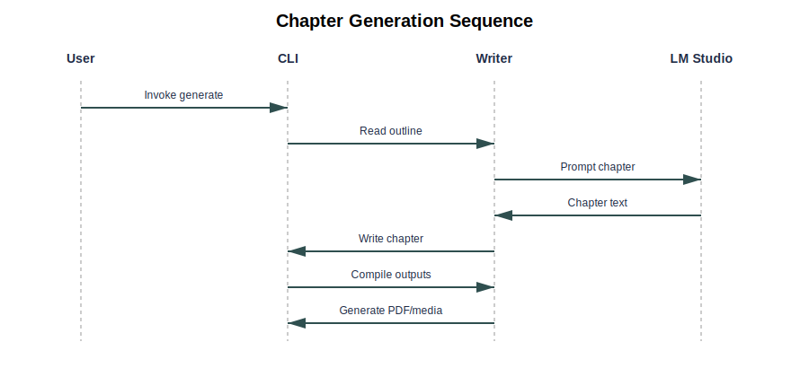

# Book generation workflows and sequences

This document captures the primary workflows for turning outlines into full books, along with key sequences between the CLI, writer engine, and LM Studio.

## Core workflow: generate a book from an outline

### Steps

1. **Select outline**: Choose the input Markdown outline file.
2. **Generate chapters**: Expand headings into chapters/sections via LM Studio.
3. **Compile book**: Stitch chapters into `book.md`.
4. **Generate PDF/EPUB**: Compile with Pandoc (and LaTeX for PDF).
5. **Optional media**: Create audio, video, and cover assets.

## Sequence: chapter generation

### Sequence notes

- The CLI (or GUI) loads the outline and delegates to the writer engine.
- The writer engine sends prompt requests to LM Studio for each chapter/section.
- Responses are written as numbered chapter markdown files.
- Once all chapters are complete, compilation and optional media generation proceed.

## Additional workflows

### Expand an existing book

1. Load the existing book directory and chapter files.
2. Expand each paragraph/section using previous and next context.
3. Regenerate `book.md`, `book.pdf`, and the title-cased EPUB.
4. Regenerate audio/video assets when enabled.

### Batch generation

1. Scan the outlines directory for Markdown files.
2. Generate a book for each outline and store results in `books/`.
3. Move processed outlines into `completed_outlines/`.

### Cover and chapter cover generation

1. Summarize the book or chapter content.
2. Generate prompts for the diffusion pipeline.
3. Write cover assets to the book directory.
